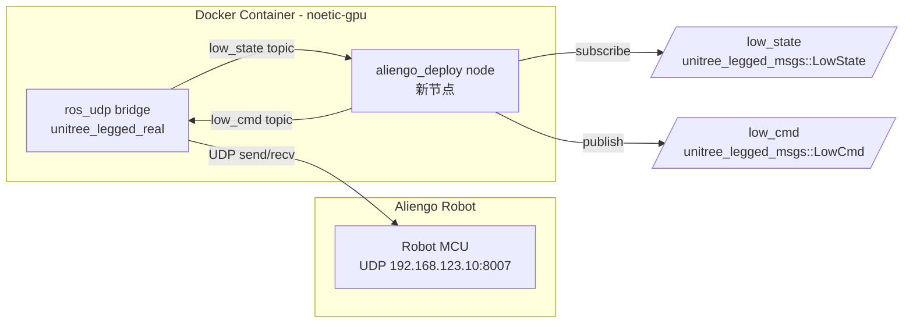
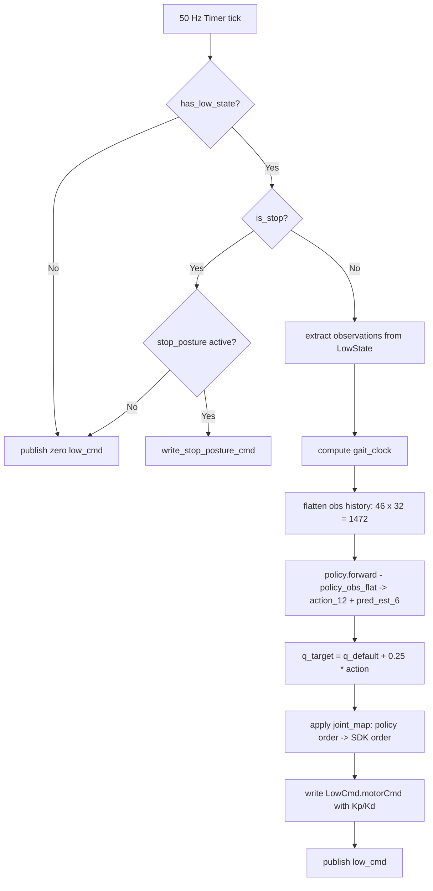
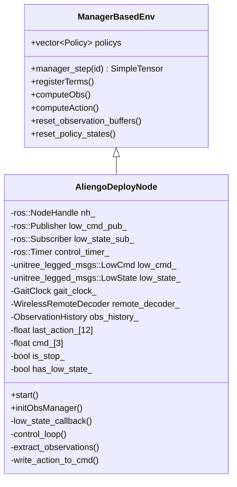

# Aliengo ROS1 Policy 部署链路规划

## 1. 总体架构

### 1.1 部署拓扑

```
本机 (macOS)                    远程机 (Ubuntu 22.04 + RTX 5070)
┌──────────────┐                ┌─────────────────────────────────────────┐
│  编写代码     │   scp/rsync   │  Docker: noetic-gpu (Ubuntu 20.04)      │
│  AliengoSim  │ ──────────── ▶│  ┌─────────────────────────────────────┐ │
│  2Real repo  │                │  │ catkin_ws/src/                      │ │
│              │                │  │   unitree_legged_msgs/              │ │
│              │                │  │   unitree_legged_real/  (ros_udp)   │ │
│              │                │  │   aliengo_deploy/       (新包)      │ │
│              │                │  │   unitree_legged_sdk/   (lib)       │ │
│              │                │  └─────────────────────────────────────┘ │
│              │                │                                         │
│              │                │  Aliengo via Ethernet 192.168.123.10    │
│              │                └────────────────┬────────────────────────┘
│              │                                 │ UDP 8091 ↔ 8007
│              │                ┌────────────────▼────────────────────────┐
│              │                │         Aliengo Robot                    │
└──────────────┘                └─────────────────────────────────────────┘
```

### 1.2 运行时数据流



### 1.3 控制循环详细流程



## 2. Policy 规格摘要

| 项目 | 值 |
|------|------|
| 架构 | AsymmetricActorCritic, 前馈式 |
| 输入维度 | 1472 = 46 × 32 history |
| 输出维度 | 12 leg joint delta + 6 pred_est |
| 动作语义 | `q_target = q_default + 0.25 * action` |
| 控制频率 | 50 Hz |
| 推理格式 | TorchScript `policy.pt` |
| 视觉输入 | 无 |
| Recurrent | 无 |

### 2.1 单帧观测向量 - 46 维

| 索引 | 名称 | 维度 | Scale | Noise |
|------|------|------|-------|-------|
| 0:2 | projected_gravity_b[x,y] | 2 | 1.0 | Gauss 0.05 |
| 2:5 | base_ang_vel_b | 3 | 0.25 | Gauss 0.2 |
| 5:17 | joint_pos - q_default | 12 | 1.0 | Gauss 0.01 |
| 17:29 | joint_vel * 0.05 | 12 | 0.05 | Gauss 1.5 |
| 29:41 | last_action_raw | 12 | 1.0 | 无 |
| 41:43 | gait_clock [sin,cos] | 2 | 1.0 | 无 |
| 43:46 | commands * [2.0,2.0,0.25] | 3 | [2.0,2.0,0.25] | 无 |

> **注意**: 部署时不加观测噪声，只保留 scale。

### 2.2 History 组织方式

- term-major, oldest→newest
- `[32×base_orientation | 32×base_ang_vel | 32×joint_pos_rel | 32×joint_vel_rel | 32×last_action | 32×gait_clock | 32×commands]`
- 启动时 warm-start：用初始观测重复填满 32 帧，`last_action` 全零

### 2.3 关节映射

```
Policy Index  Joint Name   SDK motorCmd Index
-----------   ----------   ------------------
0             FL_hip       3
1             FR_hip       0
2             RL_hip       9
3             RR_hip       6
4             FL_thigh     4
5             FR_thigh     1
6             RL_thigh     10
7             RR_thigh     7
8             FL_calf      5
9             FR_calf      2
10            RL_calf      11
11            RR_calf      8
```

### 2.4 默认关节位姿

```cpp
// policy order: FL_hip, FR_hip, RL_hip, RR_hip, FL_thigh, FR_thigh, RL_thigh, RR_thigh, FL_calf, FR_calf, RL_calf, RR_calf
const float kDefaultJointPos[12] = {
    0.1f, -0.1f, 0.1f, -0.1f,   // hip
    0.5f,  0.5f, 0.5f,  0.5f,   // thigh
   -1.0f, -1.0f,-1.0f, -1.0f    // calf
};
```

### 2.5 PD 增益

| 关节类型 | Kp (MuJoCo deploy) | Kd (MuJoCo deploy) |
|----------|--------------------|--------------------|
| hip      | 60                 | 2.45               |
| thigh    | 60                 | 2.45               |
| calf     | 96                 | 4.9                |

> Isaac 训练原始值：hip/thigh 100/3.5, calf 160/7.0。MuJoCo 导出值做了缩放，实机可能需要进一步调参。

## 3. 文件结构规划

```
ros1/
├── CMakeLists.txt                          # 顶层 catkin 包
├── package.xml
├── launch/
│   └── aliengo_deploy.launch               # 启动 ros_udp + deploy node
├── include/
│   └── aliengo_deploy/
│       ├── aliengo_constants.h             # 关节映射/默认位姿/PD增益/obs规格
│       ├── aliengo_deploy_node.h           # 主节点头文件
│       ├── gait_clock.h                    # 步态时钟生成器
│       └── wireless_remote_decoder.h       # 遥控器解码器
└── src/
    ├── aliengo_deploy_node.cpp             # 主节点实现
    ├── aliengo_deploy_main.cpp             # main 入口
    ├── gait_clock.cpp                      # 步态时钟实现
    └── wireless_remote_decoder.cpp         # 遥控器解码实现
```

复用的外部源文件（通过 CMake include 引入）:
- `utils/cpp_manager_env/ManagerEnv.hpp` + `.cpp`
- `utils/cpp_manager_env/net.h` + `.cpp`
- `utils/cpp_manager_env/SimpleTensor.hpp`
- `utils/cpp_manager_env/Buffer.hpp`
- `utils/cpp_manager_env/Noise.hpp`
- `utils/cpp_gamepad/gamepad.h` + `.cpp`（可选，本地手柄）

## 4. 分阶段实施计划

---

### Phase 0: Docker 环境与依赖准备

**目标**: 在远程机上构建可编译 ROS1 + LibTorch 的 Docker 容器

#### 4.0.1 构建 Docker 镜像

基于 `scripts/ros1ENV.MD` 已有的 Dockerfile，追加：

```dockerfile
# 在原有 Dockerfile 基础上追加
# LibTorch (CPU or CUDA)
RUN cd /opt && \
    wget -q https://download.pytorch.org/libtorch/cu118/libtorch-cxx11-abi-shared-with-deps-2.1.0%2Bcu118.zip && \
    unzip libtorch-*.zip && rm -f libtorch-*.zip
ENV CMAKE_PREFIX_PATH="/opt/libtorch:${CMAKE_PREFIX_PATH}"
ENV LD_LIBRARY_PATH="/opt/libtorch/lib:${LD_LIBRARY_PATH}"

# jsoncpp, opencv, eigen (大部分已在原 Dockerfile 中)
# udev for gamepad (可选)
RUN apt-get update && apt-get install -y --no-install-recommends \
    libudev-dev && rm -rf /var/lib/apt/lists/*
```

> 如果你的 `policy.pt` 后续也导出为 ONNX，则改用 ONNX Runtime，安装方式类似。

#### 4.0.2 初始化 unitree_legged_sdk

```bash
cd /work/projects/unitree_ros_to_real
git submodule update --init --recursive
# 如果 submodule URL 失效，从 GitHub 手动 clone:
# git clone https://github.com/unitreerobotics/unitree_legged_sdk.git
```

#### 4.0.3 catkin workspace 初始化

```bash
source /opt/ros/noetic/setup.bash
mkdir -p /root/catkin_ws/src
ln -s /work/projects/unitree_ros_to_real/unitree_legged_msgs /root/catkin_ws/src/
ln -s /work/projects/unitree_ros_to_real/unitree_legged_real /root/catkin_ws/src/
ln -s /work/projects/unitree_ros_to_real/unitree_legged_sdk /root/catkin_ws/src/
ln -s /work/projects/AliengoSim2Real/ros1 /root/catkin_ws/src/aliengo_deploy
cd /root/catkin_ws
catkin_make -DCMAKE_BUILD_TYPE=Release
source devel/setup.bash
```

---

### Phase 1: 创建 ros1/ catkin 包骨架

**目标**: 可在 catkin_ws 中编译通过的空节点

文件清单:
- `ros1/CMakeLists.txt` — catkin cmake，依赖 `roscpp`, `unitree_legged_msgs`, `OpenCV`, `Eigen3`, `jsoncpp`, `Torch` 或 `ONNX`
- `ros1/package.xml` — catkin package 声明

CMakeLists.txt 关键结构:

```cmake
find_package(catkin REQUIRED COMPONENTS roscpp unitree_legged_msgs)
find_package(Eigen3 REQUIRED)
find_package(OpenCV REQUIRED)
find_package(Torch REQUIRED)  # 或 ONNX

# 引入 utils/cpp_manager_env
set(CPP_MANAGER_ENV_PATH ${CMAKE_CURRENT_SOURCE_DIR}/../utils/cpp_manager_env)
include_directories(${CPP_MANAGER_ENV_PATH})
file(GLOB CPP_MANAGER_ENV_SRC ${CPP_MANAGER_ENV_PATH}/*.cpp)

# 引入 utils/cpp_gamepad (可选)
set(CPP_GAMEPAD_PATH ${CMAKE_CURRENT_SOURCE_DIR}/../utils/cpp_gamepad)
include_directories(${CPP_GAMEPAD_PATH})
file(GLOB CPP_GAMEPAD_SRC ${CPP_GAMEPAD_PATH}/*.cpp)

catkin_package()

add_executable(aliengo_deploy
  src/aliengo_deploy_main.cpp
  src/aliengo_deploy_node.cpp
  src/gait_clock.cpp
  src/wireless_remote_decoder.cpp
  ${CPP_MANAGER_ENV_SRC}
  ${CPP_GAMEPAD_SRC}
)
target_link_libraries(aliengo_deploy
  ${catkin_LIBRARIES} ${TORCH_LIBRARIES}
  ${OpenCV_LIBS} jsoncpp udev
)
target_compile_features(aliengo_deploy PRIVATE cxx_std_17)
```

---

### Phase 2: Aliengo 专用常量与配置头文件

**目标**: `aliengo_constants.h` 集中定义所有机器人特定参数

包含内容:
- `kAliengoJointMap[12]` — policy→SDK 映射表
- `kAliengoDefaultJointPos[12]` — 默认站姿
- `kAliengoKp[12]`, `kAliengoKd[12]` — PD 增益（按 SDK 顺序）
- `kActionScale = 0.25f`
- `kControlPeriodMs = 20` (50 Hz)
- `kObsPerFrame = 46`
- `kHistoryLength = 32`
- `kObsTotalDim = 1472`
- `kActionDim = 12`
- obs 内各 term 的偏移量和 scale 常量
- `kStopPoseStand[12]`, `kStopPoseDown[12]` — 安全姿态
- command scale `[2.0, 2.0, 0.25]`
- command deadzone `|vx|<0.1 && |vy|<0.1 && |wz|<0.2`

---

### Phase 3: WirelessRemote 解码器

**目标**: 从 `LowState.wirelessRemote[40]` 字节数组解码手柄输入

Unitree 遥控器 `wirelessRemote[40]` 内存布局（基于 Unitree SDK `comm.h`）:

```cpp
struct WirelessRemoteData {
    // bytes 0-1:  head
    // bytes 2-3:  key bitfield (uint16)
    //   bit0=R1, bit1=L1, bit2=start, bit3=select,
    //   bit4-7=R2/L2/F1/F2, bit8=A, bit9=B, bit10=X, bit11=Y,
    //   bit12=up, bit13=right, bit14=down, bit15=left
    // bytes 4-7:   lx (float) — 左摇杆X
    // bytes 8-11:  rx (float) — 右摇杆X
    // bytes 12-15: ry (float) — 右摇杆Y
    // bytes 16-19: L2 (float)
    // bytes 20-23: ly (float) — 左摇杆Y
};
```

提供:
- `WirelessRemoteDecoder::decode(const uint8_t data[40]) -> WirelessRemoteState`
- `WirelessRemoteState` 结构体: `keys`, `lx`, `ly`, `rx`, `ry`
- 按键边沿检测逻辑

---

### Phase 4: GaitClock 生成器

**目标**: 在没有从 policy 内部获取相位的情况下，生成步态时钟信号

```cpp
class GaitClock {
public:
    GaitClock(float frequency_hz, float dt);
    void step();              // 每 control tick 调用
    void reset();             // 重置相位到 0
    float phase() const;      // 当前相位 φ ∈ [0, 1)
    float sin_phase() const;  // sin(2πφ)
    float cos_phase() const;  // cos(2πφ)
private:
    float freq_;
    float dt_;
    float phase_ = 0.0f;
};
```

> **关键问题**: 训练时 gait_clock 的频率参数需要从训练配置中提取。默认 Unitree Aliengo trot 频率通常在 2.0-3.0 Hz 范围。需要你确认训练时的 `gait_frequency` 参数。

---

### Phase 5: AliengoRealDeployNode 主节点

**目标**: 完整的 ROS1 部署节点

#### 5.1 类结构



#### 5.2 与 ROS2 版本的 API 对照

| ROS2 Go2W 版本 | ROS1 Aliengo 版本 |
|----------------|-------------------|
| `rclcpp::Node` 继承 | `ros::NodeHandle` 成员 |
| `create_publisher<unitree_go::msg::LowCmd>` | `nh.advertise<unitree_legged_msgs::LowCmd>` |
| `create_subscription<unitree_go::msg::LowState>` | `nh.subscribe(..., lowStateCallback)` |
| `create_wall_timer(20ms, callback)` | `nh.createTimer(ros::Duration(0.02), callback)` |
| `RCLCPP_INFO(get_logger(), ...)` | `ROS_INFO(...)` |
| 单独 `/wirelesscontroller` topic | `low_state.wirelessRemote[40]` 解码 |
| `unitree_go::msg::LowCmd.motor_cmd[20]` | `unitree_legged_msgs::LowCmd.motorCmd[20]` |
| `low_state.imu_state.quaternion[4]` | `low_state.imu.quaternion[4]` |
| `low_state.imu_state.gyroscope[3]` | `low_state.imu.gyroscope[3]` |
| `low_state.motor_state[i].q` | `low_state.motorState[i].q` |
| `get_crc(low_cmd)` | 不需要 CRC（ros_udp bridge 处理）|
| action dim 16 (12 leg + 4 wheel) | action dim 12 (12 leg only) |

#### 5.3 Observation 提取实现

```
每个 control tick:
  1. 从 low_state_.imu 读取 quaternion -> 计算 projected_gravity -> 取 [x,y]
  2. 从 low_state_.imu 读取 gyroscope -> base_ang_vel * 0.25
  3. 从 low_state_.motorState[policy_to_sdk[i]] 读取 q -> joint_pos - default
  4. 从 low_state_.motorState[policy_to_sdk[i]] 读取 dq -> joint_vel * 0.05
  5. last_action (上一步 raw policy output, 12维)
  6. gait_clock_.step() -> [sin_phase, cos_phase]
  7. cmd_ * [2.0, 2.0, 0.25]
  
  组装单帧 46 维向量
  推入 history buffer
  flatten 为 1472 维供 policy 使用
```

#### 5.4 Action 写入实现

```
policy output: action[0..11] (raw delta)
for each i in 0..11:
    sdk_idx = kAliengoJointMap[i]      // policy→SDK
    q_target = kDefaultJointPos[i] + 0.25 * action[i]
    low_cmd.motorCmd[sdk_idx].mode = 0x0A
    low_cmd.motorCmd[sdk_idx].q    = q_target
    low_cmd.motorCmd[sdk_idx].dq   = 0.0
    low_cmd.motorCmd[sdk_idx].Kp   = kAliengoKp[sdk_idx]
    low_cmd.motorCmd[sdk_idx].Kd   = kAliengoKd[sdk_idx]
    low_cmd.motorCmd[sdk_idx].tau  = 0.0
```

#### 5.5 History Buffer 方案

两种方案可选：

**方案 A: 直接使用 ManagerBasedEnv + ObservationTerm（复用现有框架）**
- 对每个 obs 项创建 `ObservationTerm` with `history_length=32`
- 依赖框架内部 `ObservationBuffer` 管理 history
- 优点：复用度高
- 缺点：框架的 buffer 组织方式是 per-term，flatten 时需要按 term-major 顺序拼接

**方案 B: 自定义 RingBuffer（更简单直接）**
- 维护一个 `float ring_buffer[32][46]`
- 每 tick 推入一帧 46 维
- flatten 时按 term-major 手动切片重排
- 优点：完全透明可控
- 缺点：不复用 ManagerBasedEnv 的 buffer

> **推荐方案 A**，但如果 ManagerBasedEnv 的 buffer flatten 顺序不匹配训练时的 term-major 布局，则退回方案 B。

---

### Phase 6: Main 入口与 Launch 文件

**目标**: 完成可运行的入口

#### 6.1 aliengo_deploy_main.cpp

```cpp
int main(int argc, char** argv) {
    ros::init(argc, argv, "aliengo_deploy");

    // 解析命令行参数: policy_path, device, gait_freq, etc.
    std::string policy_path = parse_arg(argc, argv, "policy_path", DEFAULT_PATH);
    
    std::vector<PolicySpec> specs;
    specs.push_back(PolicySpec::MLP(policy_path, "aliengo_locomotion"));
    
    AliengoDeployNode node(specs);
    node.start();
    
    ros::spin();
    return 0;
}
```

#### 6.2 aliengo_deploy.launch

```xml
<launch>
    <!-- 1. 启动 ros_udp bridge (low-level) -->
    <node pkg="unitree_legged_real" type="ros_udp" name="ros_udp"
          output="screen" args="LOWLEVEL"/>

    <!-- 2. 启动 policy deploy node -->
    <node pkg="aliengo_deploy" type="aliengo_deploy" name="aliengo_deploy"
          output="screen">
        <param name="policy_path" value="$(find aliengo_deploy)/../../policy/your_policy/"/>
        <param name="use_local_gamepad" value="false"/>
        <param name="gait_frequency" value="2.5"/>
    </node>
</launch>
```

---

### Phase 7: 安全启停逻辑

**目标**: 提供安全的开始/停止机制

#### 7.1 启动流程

```
1. 节点启动, is_stop = true
2. 持续发布零力矩 low_cmd (所有电机 Kp=0, Kd=0, tau=0)
3. 等待收到第一个 low_state
4. 等待遥控器按键 A (enable) -> is_stop = false
5. 执行站立缓动 (interpolate to default pose in ~50 ticks = 1s)
6. 站立完成后进入 policy 控制循环
```

#### 7.2 停止流程（按键 B）

```
1. is_stop = true, stop_state = ToStand
2. 记录当前关节位置 start_pos
3. 50 ticks: lerp(start_pos -> stand_pos) with Kp=60, Kd=5
4. 90 ticks: lerp(stand_pos -> down_pos) with Kp=60, Kd=5
5. 到达卧姿后保持
```

#### 7.3 急停

- 遥控器 L2+B 组合键或本地 gamepad B 键
- 立即将所有电机设为阻尼模式：`Kp=0, Kd=3.0, tau=0, q=PosStopF, dq=VelStopF`

---

### Phase 8: 集成测试与部署启动流程

#### 8.1 编译验证

```bash
# 在 Docker 容器中
source /opt/ros/noetic/setup.bash
cd /root/catkin_ws
catkin_make -DCMAKE_BUILD_TYPE=Release
source devel/setup.bash
```

#### 8.2 分步测试

| 步骤 | 测试内容 | 验证方法 |
|------|---------|---------|
| T1 | ros_udp 能否启动 | `roslaunch unitree_legged_real real.launch ctrl_level:=lowlevel` |
| T2 | aliengo_deploy 能否编译运行 | 节点启动, 看到 `[INFO] Waiting for low_state...` |
| T3 | 能否接收 low_state | 日志打印 IMU 四元数 |
| T4 | 零力矩模式安全 | 机器人上电后应无力矩输出 |
| T5 | 遥控器解码 | 日志打印按键事件 |
| T6 | 悬挂测试 policy | 机器人悬挂, 按 A 启用, 观测腿部运动 |
| T7 | 落地测试 | 缓慢放到地面, 验证站立 |

#### 8.3 完整启动脚本

```bash
#!/bin/bash
# start_aliengo_deploy.sh
set -e

source /opt/ros/noetic/setup.bash
source /root/catkin_ws/devel/setup.bash

echo "=== Aliengo ROS1 Policy Deploy ==="
echo "Make sure:"
echo "  1. Aliengo is connected via Ethernet (192.168.123.10)"
echo "  2. Aliengo is in LOW-LEVEL mode"
echo "  3. Protection frame is attached"
echo ""
echo "Press Enter to start..."
read

roslaunch aliengo_deploy aliengo_deploy.launch
```

## 5. 关键差异与注意事项

### 5.1 CRC 问题

当前 ROS2 代码中 `get_crc(low_cmd_)` 是 Go2 特有的。Aliengo 的 `ros_udp` bridge 使用的是 SDK 内部的 CRC/校验，**不需要**在 ROS 消息层手动计算 CRC。`LowCmd.msg` 中虽有 `crc` 字段，但在通过 ros_udp bridge 时由 `convert.h` 中的 `rosMsg2Cmd()` 直接拷贝给 SDK 结构体，SDK 的 `SetSend()` 会处理校验。

### 5.2 motorCmd mode 字段

- Go2 ROS2: `mode = 0x01`
- Aliengo ROS1 (参考 example_position.cpp): `mode = 0x0A` (PMSM servo mode)

### 5.3 IMU 数据字段名

| ROS2 unitree_go | ROS1 unitree_legged_msgs |
|-----------------|-------------------------|
| `imu_state.quaternion` | `imu.quaternion` |
| `imu_state.gyroscope` | `imu.gyroscope` |
| `imu_state.accelerometer` | `imu.accelerometer` |

### 5.4 Quaternion 约定

- Unitree SDK IMU 四元数顺序：`[w, x, y, z]`
- 与 policy 训练时 Isaac 中的约定一致
- `projected_gravity = quat_rotate_inverse(root_quat, [0,0,-1])` 取 `[x,y]`

### 5.5 gait_clock 需要确认的参数

训练中的 `gait_frequency` 值需从训练配置读取。如果 `policy.json` 中有记录则可直接读取。否则需要手动指定（通过 launch param 或命令行）。

### 5.6 unitree_legged_sdk submodule

`unitree_ros_to_real/unitree_legged_sdk/` 当前为空目录。需要：
1. `git submodule update --init` 或
2. 手动从 https://github.com/unitreerobotics/unitree_legged_sdk clone
3. 确保 SDK 版本与 Aliengo 固件匹配（通常是 v3.x for Aliengo）

## 6. 需要你提供/确认的事项

1. **gait_clock 频率**: 训练时的 `gait_frequency` 参数值是多少？
2. **policy.pt 文件**: 需要复制到 workspace 或在 launch 中指定路径
3. **policy.json**: 如果有，可自动读取 PD 增益和默认位姿
4. **Aliengo SDK 版本**: 你的 Aliengo 固件对应的 `unitree_legged_sdk` 版本
5. **网络配置**: 远程机到 Aliengo 的以太网连接是否配置好 (192.168.123.x 网段)
