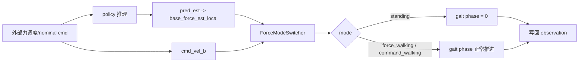
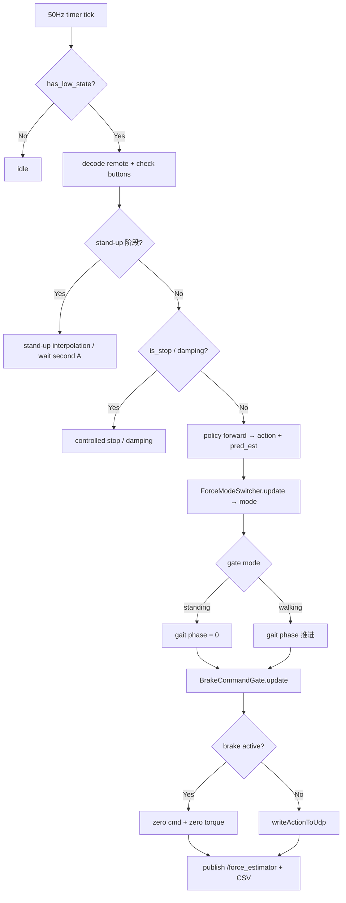

[`scripts/mujoco/smart_gait.py`](scripts/mujoco/smart_gait.py) 里的 standing / walking gate，本质上是一个“基于估计底座受力 + 指令是否为零”的三态切换器，核心实现是 [`ForceModeSwitcher`](scripts/mujoco/smart_gait.py:1205)，而你说的 v2 配置来自 [`GATE_PRESET_V2`](scripts/mujoco/smart_gait.py:273)，并在 [`apply_gate_preset()`](scripts/mujoco/smart_gait.py:1734) 里覆盖 CLI 参数，随后在 [`main()`](scripts/mujoco/smart_gait.py:1863) 中实例化切换器并每个控制周期调用 [`ForceModeSwitcher.update()`](scripts/mujoco/smart_gait.py:1260)。

## 1. 三种 mode 是什么

定义在 [`MODE_STANDING`](scripts/mujoco/smart_gait.py:76)、[`MODE_FORCE_WALKING`](scripts/mujoco/smart_gait.py:77)、[`MODE_COMMAND_WALKING`](scripts/mujoco/smart_gait.py:78)：

- `standing`：站立模式
- `force_walking`：当外部力足够明显、且当前用户速度指令接近 0 时，由“受力门控”触发的行走模式
- `command_walking`：只要显式速度命令不为 0，就直接进入命令行走模式

名字映射见 [`MODE_NAME_BY_ID`](scripts/mujoco/smart_gait.py:80)。

---

## 2. gate 的输入是什么

[`ForceModeSwitcher.update()`](scripts/mujoco/smart_gait.py:1260) 每步接收两个关键输入：

- `cmd_vel_b`：当前机体坐标系速度命令
- `base_force_est_local`：策略输出的底座受力估计

其中 `cmd_vel_b` 是否视为“零命令”，由 [`classify_command_zero()`](scripts/mujoco/smart_gait.py:1241) 判断：

- `|vx| < 0.1`
- `|vy| < 0.1`
- `|wz| < 0.2`

这些默认阈值来自 [`LIN_VEL_X_CLIP`](scripts/mujoco/smart_gait.py:55)、[`LIN_VEL_Y_CLIP`](scripts/mujoco/smart_gait.py:56)、[`ANG_VEL_YAW_CLIP`](scripts/mujoco/smart_gait.py:57)，CLI 默认值在 [`build_arg_parser()`](scripts/mujoco/smart_gait.py:1836)。

也就是说：

- 命令不为 0 → 不走 standing/force gate，直接 `command_walking`
- 命令约等于 0 → 才通过受力证据决定 `standing` 还是 `force_walking`

---

## 3. v2 preset 的参数

[`GATE_PRESET_V2`](scripts/mujoco/smart_gait.py:273) 的覆盖值是：

- `evidence_cap_n = 10.0`
- `baseline_tau_s = 1.0`
- `baseline_margin_n = 0.34`
- `baseline_update_max_n = 1.00`
- `enter_threshold_n = 8.00`
- `exit_threshold_n = 0.15`
- `enter_tau_on_s = 0.08`
- `enter_tau_off_s = 0.22`
- `exit_tau_on_s = 0.04`
- `exit_tau_off_s = 0.10`
- `enter_score_threshold = 0.90`
- `exit_score_threshold = 0.60`
- `dir_consistency_min_force_n = 1.00`
- `dir_consistency_tau_s = 0.16`
- `dir_consistency_threshold = 0.72`
- `switch_cooldown_s = 1.00`
- `enter_hold_s = 0.12`
- `exit_hold_s = 0.04`

文件里的注释直接说明 v2 是“针对 base-only policy（受力估计更 noisy）调的”，核心思路见 [`GATE_PRESET_V2`](scripts/mujoco/smart_gait.py:269)：

- 把 `evidence_cap_n` 拉高到 `10N`
- 把进入阈值提升到 `8N`
- 让真实外力（20~40N）和估计漂移噪声（≤6N）在评分管线里更好分离
- 同时尽量保留接近 v1 的进入延迟

---

## 4. standing / walking gate 的判定流程

可以把它理解成 5 个步骤。

### 4.1 先判断是不是 command walking

在 [`ForceModeSwitcher.update()`](scripts/mujoco/smart_gait.py:1282) 里：

- 如果 `command_zero == False`
- 直接把 `mode = MODE_COMMAND_WALKING`
- 并且把 force-gate 的内部状态清空：`force_state` 回到 standing，分数/计时器/cooldown 清零

所以 standing / force_walking gate 只在“无显式命令”时工作。

### 4.2 对原始受力做裁剪与基线估计

在 [`ForceModeSwitcher.update()`](scripts/mujoco/smart_gait.py:1265) 起：

1. 原始平面受力大小：
   `force_xy_raw = ||base_force_est_local[:2]||`
2. 证据裁剪：
   `force_xy_cap = clip(force_xy_raw, 0, evidence_cap_n)`

在 v2 下，最大证据被截到 `10N`。

然后在 standing 状态、且不在 cooldown、且当前力不离谱时，更新背景基线 [`force_baseline`](scripts/mujoco/smart_gait.py:1231)：

更新条件见 [`ForceModeSwitcher.update()`](scripts/mujoco/smart_gait.py:1293)：

- 当前 `force_state == standing`
- `cooldown_timer <= 0`
- `force_xy_cap <= force_baseline + baseline_update_max_n`

满足时用一阶低通更新：

- `baseline_tau_s = 1.0s`
- `baseline_update_max_n = 1.0N`

含义是：

- 只有在“看起来像正常噪声”的小力范围里才更新背景基线
- 避免把真正的人拉拽也吸收到 baseline 里

### 4.3 计算真正的“超额受力”

核心量是 [`force_excess`](scripts/mujoco/smart_gait.py:1301)：

`force_excess = max(force_xy_cap - force_baseline - baseline_margin_n, 0)`

v2 里：

- `baseline_margin_n = 0.34N`

这一步很关键：

- `force_baseline` 表示估计器长期漂移 / 静态噪声底
- `baseline_margin_n` 是额外安全边界
- 只有超过“基线 + margin”的部分，才算进入/退出判定的有效证据

### 4.4 加入“方向一致性”过滤

不仅要“力大”，还要“方向持续一致”。

这部分逻辑在 [`ForceModeSwitcher.update()`](scripts/mujoco/smart_gait.py:1270) 到 [`ForceModeSwitcher.update()`](scripts/mujoco/smart_gait.py:1280)：

- 当前力方向：对 `base_force_est_local[:2]` 归一化
- 当 `force_xy_raw >= dir_consistency_min_force_n` 时，认为方向有效
- 和上一帧方向做点积，得到 `dir_alignment ∈ [0, 1]`
- 再经过低通，得到 `dir_consistency`

v2 参数：

- `dir_consistency_min_force_n = 1.0N`
- `dir_consistency_tau_s = 0.16s`
- `dir_consistency_threshold = 0.72`

进入分数不是只看力，而是：

- 先把超额受力归一化成 `enter_force_target = clip(force_excess / enter_threshold_n, 0, 1)`
- 再把方向一致性压成 `dir_term`
- 最终 `enter_target = enter_force_target * dir_term`

即：

- 受力很大但方向乱跳，不容易进 walking
- 受力持续且方向稳定，才容易进 walking

这正是 v2 对 noisy estimator 的重要抑制机制。

### 4.5 用 enter / exit score + hold timer 做迟滞切换

真正切换不是瞬时阈值，而是“分数滤波 + 持续时间”。

#### 进入 walking

在 [`ForceModeSwitcher.update()`](scripts/mujoco/smart_gait.py:1314) 之后：

- `enter_score` 朝 `enter_target` 逼近
- 上升时间常数 `enter_tau_on_s = 0.08s`
- 下降时间常数 `enter_tau_off_s = 0.22s`

当：

- 当前 `force_state == standing`
- `cooldown_timer <= 0`
- `enter_score >= 0.90`

则开始累计 `enter_timer`。

只有当：

- `enter_timer >= 0.12s`

才真正切到 `MODE_FORCE_WALKING`，见 [`ForceModeSwitcher.update()`](scripts/mujoco/smart_gait.py:1338)。

#### 退出 walking

退出目标定义为：

`exit_target = 1 - clip(force_excess / exit_threshold_n, 0, 1)`

v2 下：

- `exit_threshold_n = 0.15N`

意思是只要超额受力很小，`exit_target` 就会接近 1，推动退出分数上升。

退出分数滤波参数：

- `exit_tau_on_s = 0.04s`
- `exit_tau_off_s = 0.10s`

当：

- 当前 `force_state == force_walking`
- `exit_score >= 0.60`
- 持续 `exit_hold_s = 0.04s`

就退回 `MODE_STANDING`，见 [`ForceModeSwitcher.update()`](scripts/mujoco/smart_gait.py:1354)。

#### cooldown

每次 standing ↔ walking 切换后，都会设置：

- `cooldown_timer = 1.0s`

这见 [`ForceModeSwitcher.update()`](scripts/mujoco/smart_gait.py:1344) 和 [`ForceModeSwitcher.update()`](scripts/mujoco/smart_gait.py:1360)。

作用：

- 防止刚切换后立即反复震荡
- 也暂时冻结 baseline 更新 / 另一方向的切换累积

---

## 5. standing 与 walking 对 gait phase 的直接影响

虽然 gate 负责 mode 判定，但真正影响 gait phase 的地方在 [`SmartGaitPhaseClock.step()`](scripts/mujoco/smart_gait.py:1546)：

- 如果 `mode == MODE_STANDING`，`phase = 0.0`
- 否则按 `gait_frequency_hz` 累加循环相位

所以：

- `standing`：步态相位被硬复位为 0，相当于冻结 gait
- `force_walking` / `command_walking`：步态相位正常推进，策略进入 walking 节律

这是 standing/walking gate 最核心的下游作用。

---

## 6. 在主循环里，这个 gate 是怎么接线的

在 [`main()`](scripts/mujoco/smart_gait.py:1863) 的控制循环 [`run_one_control_step()`](scripts/mujoco/smart_gait.py:2007) 中：

1. 调度器给出外力与 nominal command
2. 策略输出 `action, pred_est`
3. 用 [`extract_force_estimator_outputs()`](scripts/mujoco/smart_gait.py:1569) 从 `pred_est` 中抽出 `base_force_est_local`
4. 调用 [`ForceModeSwitcher.update()`](scripts/mujoco/smart_gait.py:2054)
5. 用 `mode_state.mode` 驱动 [`SmartGaitPhaseClock.step()`](scripts/mujoco/smart_gait.py:2109)
6. 新 gait phase 再写回 policy observation

简化成图：



---

## 7. 用 v2 配置时，standing/walking gate 的实际性格

如果只总结行为特征，v2 可以概括为：

### standing 更稳

因为 [`GATE_PRESET_V2`](scripts/mujoco/smart_gait.py:273) 把：

- `evidence_cap_n` 提高到 `10N`
- `enter_threshold_n` 提高到 `8N`
- `enter_hold_s` 拉长到 `0.12s`
- `dir_consistency_threshold` 提高到 `0.72`

所以小漂移、小误差、方向乱跳的噪声，很难把 standing 顶进 walking。

### walking 一旦进入，退出很快

因为：

- `exit_threshold_n = 0.15N` 很小
- `exit_tau_on_s = 0.04s` 很快
- `exit_hold_s = 0.04s` 也很短

这意味着当拉力明显消失后，系统会比较快回 standing，避免“人已经不拉了但还在走”。

### 对 noisy base-only estimator 更友好

文件注释已经点明，v2 是专门为 base-only force estimator 调的。它的核心不是“更灵敏”，而是：

- 更强调真实有效证据
- 更抑制估计漂移和方向抖动
- 保持 reasonably fast 的进入响应

---

## 8. 一句话总结

用 [`GATE_PRESET_V2`](scripts/mujoco/smart_gait.py:273) 时，这个 standing/walking gate 的逻辑可以概括为：

- **有显式速度命令** → 直接 `command_walking`
- **无显式速度命令** → 看估计底座受力
  - 若“超额受力足够大 + 方向持续一致 + 持续时间足够长” → `force_walking`
  - 若受力不足或消失 → `standing`
- `standing` 会把 gait phase 锁到 0；`walking` 才让 gait phase 连续推进

因此它不是简单的力阈值开关，而是一个带有 **baseline 去漂移、方向一致性校验、双时间常数分数滤波、hold timer、cooldown 抗抖** 的 standing/walking 状态机。

---

## 9. ROS1 实机部署实现状态

### 架构

当前使用 **TX2 relay** 架构：Docker (策略推理) → TX2 (SDK v3.0.0 relay) → 运动控制器。
详见 [`ros1/README.md`](../ros1/README.md)。

### 已完成的改动

| 改动 | 文件 | 说明 |
|------|------|------|
| `pred_est` 提取 | [`net.h`](../utils/cpp_manager_env/net.h) | 添加 `get_last_aux_output()` getter，`last_aux_output_` 成员 |
| Tuple 解包 | [`net.cpp`](../utils/cpp_manager_env/net.cpp) | TorchScript 返回 Tuple 时自动存储 `elements[1]` 到 `last_aux_output_` |
| C++ ForceModeSwitcher | [`force_mode_switcher.h`](../ros1/include/aliengo_deploy/force_mode_switcher.h) | 完整移植 Python 版三态状态机，内置 v2 / v2_robust 两套 preset |
| GaitClock mode 控制 | [`gait_clock.h`](../ros1/include/aliengo_deploy/gait_clock.h) | `setStanding()` 冻结 phase=0 |
| 控制循环集成 | [`aliengo_deploy_node.cpp`](../ros1/src/aliengo_deploy_node.cpp) | gate + pred_est 提取 + gait 模式驱动 + stand-up 前段 |
| Force ROS topic | [`aliengo_deploy_node.cpp`](../ros1/src/aliengo_deploy_node.cpp) | 发布 `/force_estimator` (geometry_msgs/WrenchStamped) |
| CSV 日志 | [`aliengo_deploy_node.cpp`](../ros1/src/aliengo_deploy_node.cpp) | `force_log_csv` 非空时每步记录 cmd, pred_est, mode, gate + brake 内部状态 |
| TX2 relay | [`aliengo_relay.cpp`](../ros1/tx2_relay/aliengo_relay.cpp) | TX2 上用 SDK v3.0.0 转发命令/状态（控制器只接受板载 PC） |
| Stand-up 前段 | [`aliengo_deploy_node.cpp`](../ros1/src/aliengo_deploy_node.cpp) | 6 秒协调插值，后腿略提前、前腿略滞后，到默认站姿后等待第二次 A 接入策略 |
| Gate preset 选择 | [`aliengo_deploy_main.cpp`](../ros1/src/aliengo_deploy_main.cpp) | 启动参数 `gate_preset` 支持 v2 / v2_robust |

### 控制循环流程（当前版本）



### Launch 参数

| 参数 | 默认 | 说明 |
|------|------|------|
| `gate_preset` | `v2` | standing/walking gate 预设 (v2 / v2_robust) |
| `robot_ip` | `192.168.123.12` | TX2 relay IP |
| `robot_port` | `9000` | TX2 relay 端口 |
| `inference_device` | `cpu` | 推理设备 |
| `gait_frequency` | `2.0` | gait clock 频率 (Hz) |
| `force_log_csv` | 空 | 非空时写 CSV，例如 `/tmp/force_estimator_log.csv` |

### 查看 force estimator

```bash
# 实时 echo
rostopic echo /force_estimator

# 录 bag
rosbag record /force_estimator /low_cmd /low_state

# 写 CSV，需要节点启动时传入
roslaunch aliengo_deploy aliengo_deploy.launch \
  force_log_csv:=/tmp/force_estimator_log.csv

docker exec noetic-gpu head -5 /tmp/force_estimator_log.csv
docker cp noetic-gpu:/tmp/force_estimator_log.csv ./
```

### 实机测试进度

- [x] Docker 内静态测试（fake publisher + 策略推理）
- [x] 直连 UDP 读取状态（IMU + 电机 + 遥控器）
- [x] TX2 relay 编译运行
- [x] 6 秒 stand-up 插值 + 第二次 A 接入策略（保护架下）
- [ ] 关节映射手动逐腿验证（**关键！** 观察到 RR/FR 可能交换）
- [ ] 脱离保护架地面行走
- [ ] v2 preset 阈值是否需要针对实机重新调整
- [ ] force estimator 噪声分布 vs MuJoCo sim2sim
