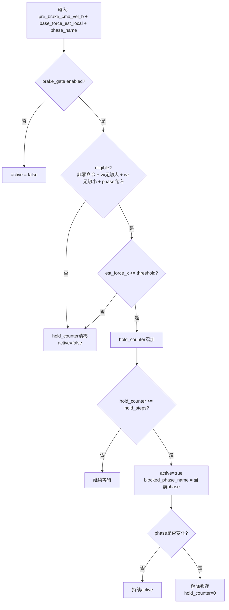

下面接着把 [`BrakeCommandGate`](scripts/mujoco/smart_gait.py:1462) 的 brake 判断机制完整列出来。它和 standing / walking gate 不一样：**它不是 mode 切换器，而是一个“在特定 walking phase 中，把已经生成的前进命令和外力强行刹停”的保护门**。实际调用链在 [`run_one_control_step()`](scripts/mujoco/smart_gait.py:2007)。

## 1. brake gate 在控制链路里的位置

在主循环里，顺序是：

1. 先由 [`ForceModeSwitcher.update()`](scripts/mujoco/smart_gait.py:1260) 判定 standing / walking mode
2. 再由 [`ForceGuidedTurningController.compute()`](scripts/mujoco/smart_gait.py:1404) 生成 `pre_brake_cmd_vel_b`
3. 然后把这个 `pre_brake_cmd_vel_b` 和估计受力送进 [`BrakeCommandGate.update()`](scripts/mujoco/smart_gait.py:1482)
4. 如果 brake 激活，就在 [`run_one_control_step()`](scripts/mujoco/smart_gait.py:2071) 里把：
   - `guidance_state.effective_cmd_vel_b = 0`
   - `applied_force_w = 0`

关键代码在：

- [`pre_brake_cmd_vel_b = guidance_state.effective_cmd_vel_b.astype(...)`](scripts/mujoco/smart_gait.py:2064)
- [`brake_state = brake_gate.update(...)`](scripts/mujoco/smart_gait.py:2065)
- [`if brake_state.active: ...`](scripts/mujoco/smart_gait.py:2072)

所以 brake gate 的作用非常直接：**一旦触发，最终送给策略/仿真的运动命令和外部引导力都会被清零。**

---

## 2. brake gate 的设计目标

从逻辑上看，它是在某些“本来正在向前走/转向”的阶段里，监测估计到的底座局部 `x` 向受力；如果这个力变得足够负，说明出现明显反向阻滞/刹车迹象，就立即停止推进。

也就是：

- 当前命令还在要求前进
- 但估计到机体 `x` 向已经出现很大的负向力
- 那就认为继续推着走不合理，于是 brake

---

## 3. 默认参数

默认常量定义在：

- [`BRAKE_GATE_FORCE_X_THRESHOLD_N = -32.0`](scripts/mujoco/smart_gait.py:58)
- [`BRAKE_GATE_MIN_CMD_VX = 0.2`](scripts/mujoco/smart_gait.py:59)
- [`BRAKE_GATE_MAX_CMD_WZ = 0.10`](scripts/mujoco/smart_gait.py:60)
- [`BRAKE_GATE_HOLD_STEPS = 2`](scripts/mujoco/smart_gait.py:61)

CLI 参数在 [`build_arg_parser()`](scripts/mujoco/smart_gait.py:1848) 到 [`build_arg_parser()`](scripts/mujoco/smart_gait.py:1852)：

- `--brake-gate`
- `--brake-gate-force-x-threshold-n`
- `--brake-gate-min-cmd-vx`
- `--brake-gate-max-cmd-wz`
- `--brake-gate-hold-steps`

实例化时这些值被读入 [`BrakeCommandGate.__init__()`](scripts/mujoco/smart_gait.py:1463)。

---

## 4. brake 只在哪些 phase 允许触发

允许 brake 的 phase 被硬编码在 [`BRAKE_GATE_ELIGIBLE_PHASES`](scripts/mujoco/smart_gait.py:86)：

- `walk_backward_pull`
- `walk_backward_ramp`

这两个名字对应 human-guide 尾段 walking block 的 phase 名称，常量定义见：

- [`HUMAN_GUIDE_PHASE_WALK_BACKWARD_PULL`](scripts/mujoco/smart_gait.py:111)
- [`HUMAN_GUIDE_PHASE_WALK_BACKWARD_RAMP`](scripts/mujoco/smart_gait.py:112)

因此 brake gate **不是全局随时可触发**，而是只在这两个指定 phase 内工作。

---

## 5. brake 的判断输入是什么

[`BrakeCommandGate.update()`](scripts/mujoco/smart_gait.py:1482) 的输入有 3 个：

- `cmd_vel_b`：这里传入的是 `pre_brake_cmd_vel_b`，也就是 guidance 之后、真正 brake 之前的命令，见 [`run_one_control_step()`](scripts/mujoco/smart_gait.py:2064)
- `base_force_est_local`：策略估计的底座局部受力
- `phase_name`：当前调度 phase，来自 scheduler 输出，见 [`run_one_control_step()`](scripts/mujoco/smart_gait.py:2068)

其中真正用于刹车阈值判断的是：

- [`est_force_x_n = float(base_force_est_local[0])`](scripts/mujoco/smart_gait.py:1493)
- [`est_force_y_n = float(base_force_est_local[1])`](scripts/mujoco/smart_gait.py:1494)

如果不是有限数，会被置 0，见 [`BrakeCommandGate.update()`](scripts/mujoco/smart_gait.py:1495)。

---

## 6. 第一步：先判断当前命令是不是“非零命令”

[`BrakeCommandGate._command_nonzero()`](scripts/mujoco/smart_gait.py:1475) 复用了和 standing/walking gate 类似的 clip 判定：

只有当下列条件**不同时成立**时，命令才算 nonzero：

- `|vx| < lin_vel_x_clip`
- `|vy| < lin_vel_y_clip`
- `|wz| < ang_vel_yaw_clip`

这里的阈值来自：

- [`lin_vel_x_clip`](scripts/mujoco/smart_gait.py:1468)
- [`lin_vel_y_clip`](scripts/mujoco/smart_gait.py:1469)
- [`ang_vel_yaw_clip`](scripts/mujoco/smart_gait.py:1470)

也就是说，**如果当前几乎没命令，本来就不需要 brake。**

---

## 7. 第二步：判断是否具备触发资格 `eligible`

资格条件集中在 [`eligible = bool(...)`](scripts/mujoco/smart_gait.py:1501)：

需要同时满足：

1. `self.enabled`
   - 即必须显式打开 `--brake-gate`
2. [`self._command_nonzero(cmd_vel_b)`](scripts/mujoco/smart_gait.py:1503)
   - 当前确实有运动命令
3. [`float(cmd_vel_b[0]) >= self.min_cmd_vx`](scripts/mujoco/smart_gait.py:1504)
   - 前向速度命令至少达到最小值，默认 `0.2`
4. [`abs(float(cmd_vel_b[2])) <= self.max_cmd_wz`](scripts/mujoco/smart_gait.py:1505)
   - 转向角速度不能太大，默认 `|wz| <= 0.10`
5. [`phase_name in BRAKE_GATE_ELIGIBLE_PHASES`](scripts/mujoco/smart_gait.py:1506)
   - 当前 phase 必须属于前述两个允许 brake 的阶段

这说明 brake gate 的设计意图非常明确：

- 只处理“**明显前进**”的场景
- 不处理几乎静止的命令
- 不处理大转向动作
- 只处理指定 backward-pull/ramp 阶段

---

## 8. 第三步：真正的刹车触发条件 `trigger_sample`

真正采样触发在 [`trigger_sample = bool(...)`](scripts/mujoco/smart_gait.py:1508)：

条件是：

- 当前还没有锁存到这个 phase：`not latched_phase_active`
- 已经具备资格：`eligible`
- [`est_force_x_n <= self.force_x_threshold_n`](scripts/mujoco/smart_gait.py:1508)

默认阈值是：

- `force_x_threshold_n = -32N`

因此可以直译为：

> 当系统正在一个允许 brake 的前进行走 phase 中，且机体局部 `x` 向估计力小于等于 `-32N`，就认为出现了足够强的反向制动迹象。

注意这里看的是 **局部坐标系 x 分量**，不是力的模长，也不是 y 分量。

---

## 9. 第四步：用 `hold_steps` 做离散去抖

brake 不是单帧触发，而是连续采样确认。

逻辑在 [`BrakeCommandGate.update()`](scripts/mujoco/smart_gait.py:1512)：

- 如果当前帧满足 `trigger_sample`
  - `hold_counter += 1`
- 否则
  - `hold_counter = 0`

然后：

- [`active = bool(eligible and self.hold_counter >= self.hold_steps)`](scripts/mujoco/smart_gait.py:1516)

默认：

- `hold_steps = 2`

所以默认行为是：

- 连续 2 个控制步都看到 `est_force_x_n <= -32N`
- 才真正认为 brake active

这相当于一个很轻量的抗噪滤波，避免单帧估计尖峰误触发。

---

## 10. 第五步：一旦触发就“锁存到当前 phase”

如果 brake 被激活，会执行：

- [`self.blocked_phase_name = phase_name`](scripts/mujoco/smart_gait.py:1518)

随后只要当前 phase 没变，就认为仍处于锁存状态：

- [`latched_phase_active = self.blocked_phase_name == phase_name`](scripts/mujoco/smart_gait.py:1500)

当 `latched_phase_active` 为真时：

- [`active = True`](scripts/mujoco/smart_gait.py:1509)

也就是说：

- brake 一旦在某个 eligible phase 里触发
- 后面**不用继续重复满足阈值**
- 只要 phase 还没切走，就持续保持 brake active

这是 brake 机制最关键的特点之一：**它不是瞬时脉冲，而是 phase-latched one-shot brake。**

---

## 11. 第六步：什么时候解除 brake

解除条件非常简单，在 [`BrakeCommandGate.update()`](scripts/mujoco/smart_gait.py:1489)：

- 如果 `blocked_phase_name` 不为空
- 且当前 `phase_name != blocked_phase_name`
- 就清除锁存并把 `hold_counter` 归零

即：

- **phase 一变，brake 自动释放**
- 释放不看力是否恢复，也不看计时器
- 完全由“离开当前被锁存的 phase”决定

---

## 12. brake 激活后的实际效果

在 [`run_one_control_step()`](scripts/mujoco/smart_gait.py:2072) 里，如果 [`brake_state.active`](scripts/mujoco/smart_gait.py:2072) 为真：

- [`guidance_state.effective_cmd_vel_b = np.zeros(3, dtype=np.float32)`](scripts/mujoco/smart_gait.py:2073)
- [`applied_force_w = np.zeros(3, dtype=np.float32)`](scripts/mujoco/smart_gait.py:2074)

等价于：

- 不再给 locomotion command
- 不再给外部引导力

然后这个“清零后的命令”会被写回 observation，见 [`build_command_vector()` 调用](scripts/mujoco/smart_gait.py:2105)，所以 brake 不仅影响当前步，也会影响后续策略输入。

---

## 13. brake 状态输出了哪些诊断量

[`BrakeGateState`](scripts/mujoco/smart_gait.py:373) 里记录了：

- `enabled`
- `eligible`
- `active`
- `hold_counter`
- `est_force_x_n`
- `est_force_y_n`
- `threshold_x_n`
- `blocked_phase_name`

这些值会被：

- 写进 CSV，见 [`write_csv_row()`](scripts/mujoco/smart_gait.py:1592)
- 打印到日志，见 [`maybe_log_step()`](scripts/mujoco/smart_gait.py:1684)

特别是日志里会打印：

- `brake_active`
- `brake_phase`
- `brake_hold`
- `brake_fx`

便于直接观察 brake 的触发过程。

---

## 14. 用一句状态机语言概括 brake 机制

可以把 [`BrakeCommandGate`](scripts/mujoco/smart_gait.py:1462) 概括成下面这个状态机：



---

## 15. 一句话总结

[`BrakeCommandGate`](scripts/mujoco/smart_gait.py:1462) 的 brake 判断机制可以总结为：

- **必须启用 `--brake-gate`**
- **只在指定 phase**：`walk_backward_pull` / `walk_backward_ramp`
- **只在明显前进、且转向不大的命令下** 才考虑触发
- **若估计到底座局部 x 向力连续若干步低于阈值**（默认 `<= -32N`，连续 `2` 步）
- 就在当前 phase 内**锁存 brake**
- 锁存期间持续把最终命令和外部引导力都置零
- **直到 phase 切换** 才自动解除

所以它本质上是一个：**面向特定 phase 的、基于负向 x 受力的、带连续步确认和 phase 锁存的刹车保护门。**

---

## 16. ROS1 实机部署实现进度

### 设计适配说明

原始 Python 版 [`BrakeCommandGate`](scripts/mujoco/smart_gait.py:1462) 依赖 scheduler 的 `phase_name` 来限制 brake 只在特定行走阶段触发。ROS1 实机部署没有 scheduler，因此做了以下简化：

- **去掉 phase_name 依赖**：brake 在任何 walking mode（非 standing）下都可触发
- **eligibility 条件保留**：`cmd_vx >= 0.2` 且 `|wz| <= 0.10` 且 command 非零
- **latch 机制调整**：一旦触发，持续 active 直到 mode 回到 standing 或 command 归零（替代 phase-change 解锁）
- **参数保持 v2 默认**：`force_x_threshold = -32N`，`hold_steps = 2`

### 已完成的改动

| 改动 | 文件 | 说明 |
|------|------|------|
| C++ BrakeCommandGate | [`ros1/include/aliengo_deploy/brake_command_gate.h`](../ros1/include/aliengo_deploy/brake_command_gate.h) | 完整状态机：eligible → trigger_sample → hold → latch → release |
| 节点头文件 | [`ros1/include/aliengo_deploy/aliengo_deploy_node.h`](../ros1/include/aliengo_deploy/aliengo_deploy_node.h) | 添加 `brake_gate_` 成员和 `brake_enabled_` 参数 |
| 控制循环集成 | [`ros1/src/aliengo_deploy_node.cpp`](../ros1/src/aliengo_deploy_node.cpp) | gate 之后、写命令之前运行 brake；active 时零力矩 + 清零 command |
| CSV 日志扩展 | [`ros1/src/aliengo_deploy_node.cpp`](../ros1/src/aliengo_deploy_node.cpp) | 添加 `brake_eligible,brake_active,brake_hold,brake_est_fx` 列 |

### 控制循环中 brake 的位置

```
policy forward → action + pred_est
      ↓
ForceModeSwitcher → mode (standing / walking)
      ↓
GaitClock → phase freeze / advance
      ↓
BrakeCommandGate → brake active?     ← 新增
      ↓
  active: zero low_cmd + zero command
  inactive: writeActionToCmd(action)
      ↓
publish low_cmd
```

### 启动参数

| 参数 | 默认 | 说明 |
|------|------|------|
| `brake_enabled` | `true` | 启用/禁用 brake gate |

### 待验证事项

- [ ] 实机 force estimator x 分量噪声范围，确认 -32N 阈值是否合适
- [ ] latch release 条件（mode → standing 或 command → zero）是否在实际操作中足够灵敏
- [ ] brake active 时 zero low_cmd 是否应改为 hold 当前位姿而非完全释放
